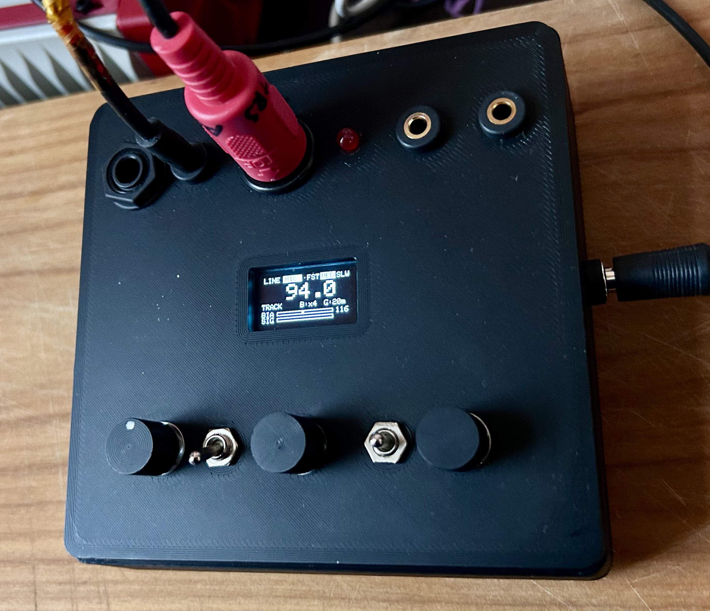

# AudioClock

A standalone box that listens to live audio and turns it into a clock.
Plug in a line signal or point the mic at a band, and AudioClock follows
the tempo and sends out:

- **MIDI clock** on DIN-5 — 24 ppqn, with Start / Stop / Continue and Song Position Pointer
- **CV clock** — 0–5 V Eurorack-compatible gate, with selectable division/multiplication

No computer needed. It runs on 9 V DC and is built around a Teensy 4.0 and
the PJRC Audio Board.

It has been field-tested on drums, full mixes, strummed guitar and solo piano.

> **Status:** v0.5, Build 50010. Working prototype; see [Known issues](#known-issues).

---

---


## How it works

```
audio in ─┬─→ RMS meter ──────────────→ silence detection → MIDI Stop
          └─→ BTT beat tracker ─┬─→ tempo (period) ─┐
                                └─→ beat times ─────┴─→ phase-corrected clock
                                                         (200 µs timer ISR)
                                                          ├─→ MIDI clock
                                                          ├─→ CV clock
                                                          └─→ beat LED
```

Tempo and beat detection are done by
[BTT (Beat-and-Tempo-Tracking)](https://github.com/michaelkrzyzaniak/Beat-and-Tempo-Tracking)
by Michael Krzyzaniak. It uses spectral-flux onset detection,
generalized-autocorrelation tempo estimation and cumulative-beat-strength
beat prediction. BTT sets the tempo. A proportional-only phase corrector
keeps the output ticks aligned with the beats BTT predicts, and a 200 µs
timer interrupt sends each tick within 1% of its correct time.

BTT is vendored in this repo with four patches for the Cortex-M7. Two make
it 3.2× faster. The other two fix its accuracy: tempo readings go from
0.12 BPM mean error to 0.03 BPM. See [docs/btt-patches.md](docs/btt-patches.md).

For the full design, see [docs/architecture.md](docs/architecture.md).

---

## Hardware

| Part | Details |
|---|---|
| MCU | Teensy 4.0 (i.MX RT1062, 600 MHz) — **do not overclock** |
| Audio | PJRC Audio Board Rev D (SGTL5000), stacked |
| Level shifter | BSS138 4-channel, 3.3 V ↔ 5 V |
| Display | SSD1306 0.96″ OLED, 128×64, I2C |
| Mic | PUI AOM-5024L electret |
| Power | 9 V DC → linear regulator → 5 V |

Pinout, wiring and MIDI output circuit: [docs/hardware.md](docs/hardware.md).

---

## Building the firmware

1. Install [Arduino IDE](https://www.arduino.cc/en/software) and
   [Teensyduino](https://www.pjrc.com/teensy/td_download.html).
2. Install **Adafruit SSD1306** and **Adafruit GFX** from the Library
   Manager. The Audio library comes with Teensyduino.
3. Open `firmware/audioclock_5/audioclock_5.ino`.
4. Board: **Teensy 4.0**, CPU speed: **600 MHz**. Upload.

Everything else, including the patched BTT library, is already in the
sketch folder. Nothing needs to be downloaded or patched by hand.

---

## Controls

| Control | Function |
|---|---|
| **BIAS** pot | Tempo bias, 60–180 BPM. This decides whether the tracker picks half-time or double-time. **Rest it at 12 o'clock (120 BPM).** |
| **DIV/MULT** pot | CV clock rate (table below) |
| **GATE** pot | CV gate length, 2–50 ms |
| **RESP** switch | How quickly the tracker follows tempo changes: FST / MED / SLW |
| **INPUT** switch | LINE / MIC |
| **HOLD** jack/button | Tempo hold. Freezes tempo and phase so the clock freewheels on its own. |

CV clock rates. The labels treat a half note as the unit, so **quarter
notes are `x2`**, which is also the power-on default:

| Label | `/2` | `/1` | `x2` | `x4` | `x8` | `T8` | `T16` |
|---|---|---|---|---|---|---|---|
| MIDI ticks | 96 | 48 | 24 | 12 | 6 | 16 | 8 |
| Note value | whole | half | quarter | 8th | 16th | quarter triplet | 8th triplet |

A 130 BPM song reading as 65 usually means BIAS is turned too low. That
isn't a bug. It's the octave control doing exactly what it's set to do.

### Transport behaviour

- Clock **starts** on the first beat once a tempo has been found (MIDI Start + SPP).
- It **stops** after 3 s of silence (MIDI Stop). The tempo is remembered, so
  when signal returns it resumes with MIDI Continue, with no new count-in.
- **HOLD** while running freezes the clock. HOLD while paused starts it
  freewheeling at the remembered tempo. The silence timeout is ignored while
  held.

---

## Display

```
[LINE|MIC] · [FST|MED|SLW]
  125.1                        ← BPM, or PAUSE / ---
TRACK  !  B:x2  G:10m          ← TRACK / FREEWHL / HOLD / PAUSED / WAITING
BIA [====|=========]  120      ← tempo bias
SIG [=======       ]           ← input level
```

`!` means audio blocks were dropped this session, which should never
happen. See [docs/architecture.md](docs/architecture.md#dropped-block-detection).

---

## Serial debug

115200 baud, once per second:

```
bpm=125.06 period=479762 bias=120 run=1 qmax=4 btt=1230avg/2853pk of 2902us
  drift=-118 drops=0 hold=0 late=195 floor=3 rms=0.124
```

| Field | Healthy value |
|---|---|
| `btt` avg | 900–1400 µs. A value near 2500 means tempo decimation isn't active. |
| `qmax` | Well below 60 |
| `late` | ≤ 200 µs (worst-case tick lateness) |
| `drops` | 0 |
| `floor` | Stays constant while the tempo is steady. See [architecture](docs/architecture.md#span-floor). |
| `rms` | Below ~0.5. Above that, the input is clipping. |

---

## Repository layout

```
firmware/audioclock_5/   complete Arduino sketch folder
  audioclock_5.ino
  BTT.h, BTT_LICENSE     vendored BTT (MIT)
  src/                   BTT sources, BTT.c + DFT.c patched
patches/                 unified diffs of every change to upstream BTT
docs/
  hardware.md            pinout, wiring, MIDI circuit
  architecture.md        clock design, timing, concurrency
  btt-patches.md         what was changed in BTT and why, with measurements
  lessons-learned.md     things that were not obvious
CHANGELOG.md
```

---

## Known issues

- Serial debug output is still enabled.
- The most expensive BTT frame uses 94–99% of its block budget. This is safe,
  because the average is 42% and the queue always drains, but that one
  frame has no margin. Options are listed in
  [btt-patches.md](docs/btt-patches.md#headroom).
- Resuming from PAUSED via HOLD sends MIDI Continue. Whether downstream gear
  picks up at its current song position hasn't been confirmed on real gear yet.
- SSD1306 stability at 1 MHz I2C depends on wiring. If the display glitches,
  set `I2C_FAST` to `400000`.

---

## Credits and licence

AudioClock is released under the [MIT licence](LICENSE).

Beat and tempo tracking by
[Michael Krzyzaniak's BTT](https://github.com/michaelkrzyzaniak/Beat-and-Tempo-Tracking),
MIT licence. Its licence is included at
[`firmware/audioclock_5/BTT_LICENSE`](firmware/audioclock_5/BTT_LICENSE).
See [THIRD_PARTY_NOTICES.md](THIRD_PARTY_NOTICES.md).

References:
- Percival & Tzanetakis, *Streamlined tempo estimation based on autocorrelation and cross-correlation with pulses*, IEEE/ACM TASLP 2014
- Davies & Plumbley, *Context-dependent beat tracking of musical audio*, IEEE TASLP 2007
